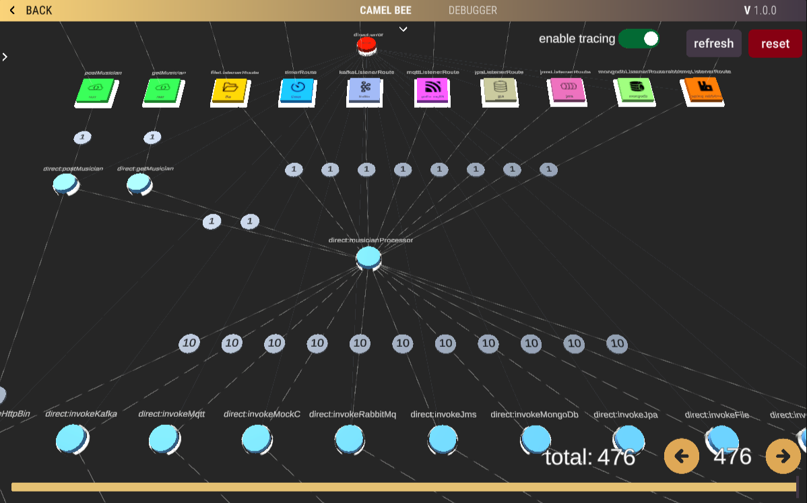
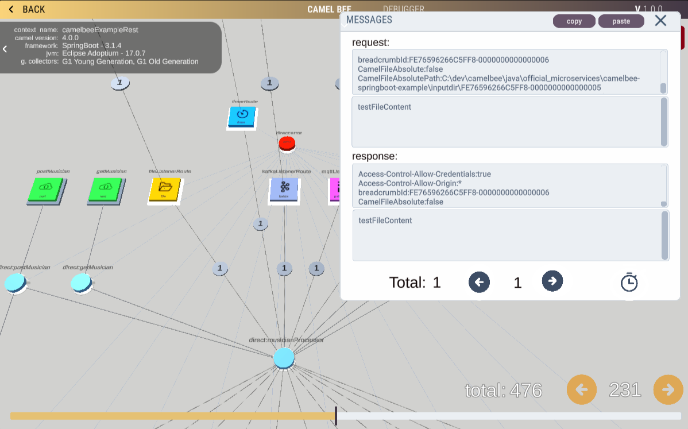

# CamelBee - Apache Camel Library for Microservices Monitoring and Debugging

CamelBee java core libraries are engineered to extract the architecture of Camel Routes, pinpoint endpoints, and map out the interconnections among them
to visualize the topology within the CamelBee WebGL application (https://www.camelbee.io).

Additionally, the library plays a crucial role in application monitoring by retrieving all pertinent metrics data.

---

## Features

### Route Visualization
- Effortlessly visualize complex Camel routes and their interconnections for a better understanding of your microservice architecture.
- Gain a clear overview of message routing and flow paths within your application.



### Message Tracing
- Trace messages as they traverse through Camel routes, enabling real-time debugging and issue identification.
- Detect bottlenecks, errors, or unexpected behavior in your message processing.


 
### Debugging and Replay
- Debug Camel routes interactively by inspecting message contents, and analyzing route behavior.
- Replay debug sessions to reproduce and investigate issues.
- Navigate through the debugging session's timeline, moving back and forth, to thoroughly analyze the process flow.



### Trigger Consumer Endpoints
- Initiate any kind of consumer endpoints direclty from the 3D environment and track message traffic.


### Real-time Monitoring
- Monitor Camel microservices with essential metrics and variables, ensuring the health and performance of your application.
- Retrieve comprehensive metrics data to keep your microservices running smoothly.
- Concurrently invoke consumer endpoints to conduct a stress test.


  
---

## Project Structure

The project is structured as follows:

```shell
camelbee/
|-- camelbee-core/
| |-- camelbee-quarkus-core/
| | |-- README.md
| | |-- ...
| |-- camelbee-springboot-core/
| | |-- README.md
| | |-- ...
|-- camelbee-examples/
| |-- allcomponent-quarkus-sample/
| | |-- README.md
| | |-- ...
| |-- allcomponent-springboot-sample/
| | |-- README.md
| | |-- ...
|-- README.md
```


- `camelbee-core`: Contains the core modules for CamelBee.
  - `camelbee-quarkus-core`: Quarkus-specific core module to integrate with the CamelBee WebGL Application (https://www.camelbee.io).
  - `camelbee-springboot-core`: Spring Boot-specific core module to integrate with the CamelBee WebGL Application (https://www.camelbee.io).

- `camelbee-examples`: Contains example projects demonstrating the usage of CamelBee.
  - `allcomponent-quarkus-sample`:  Quarkus example project which uses camelbee-quarkus-core library.
  - `allcomponent-springboot-sample`: Spring Boot example project which uses camelbee-springboot-core library.

Each subproject may have its own README file for detailed information specific to that project.

## Getting Started

To get started with any of the subprojects, follow the instructions in their respective README files located in their subdirectories. 
These README files provide step-by-step instructions on how to build, configure, and run each project.

## Contributing

If you would like to contribute to this project, please follow these steps:

1. Fork the repository.
2. Create a new branch for your feature or bug fix: `git checkout -b feature/new-feature`.
3. Make your changes and commit them: `git commit -m "Add new feature"`.
4. Push your changes to your forked repository: `git push origin feature/new-feature`.
5. Create a merge request against the main repository, explaining your changes and why they should be merged.

## License

This project is licensed under the the Apache License, Version 2.0. Feel free to use, modify, and distribute it as per the license terms.

For specific license information for individual subprojects, refer to their respective README files.
