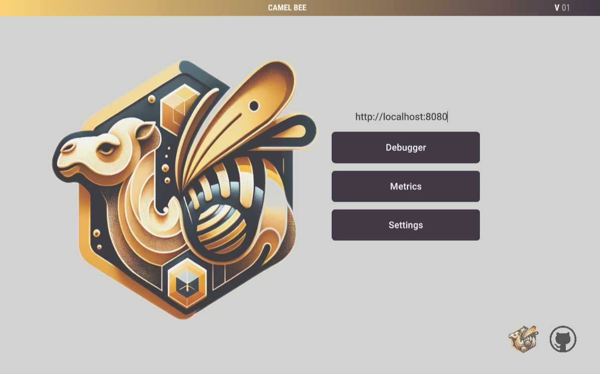
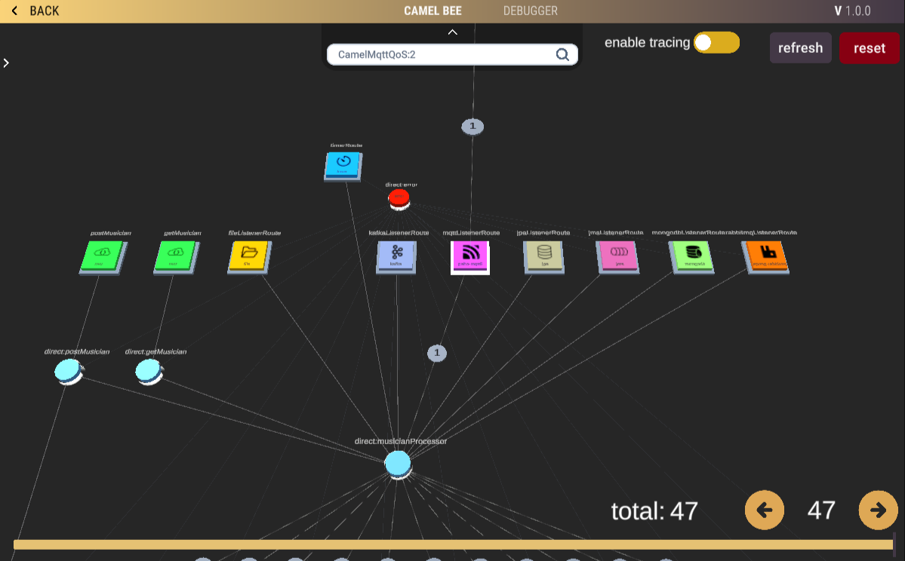
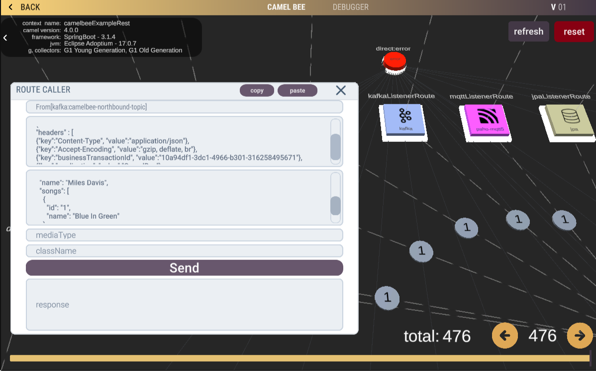
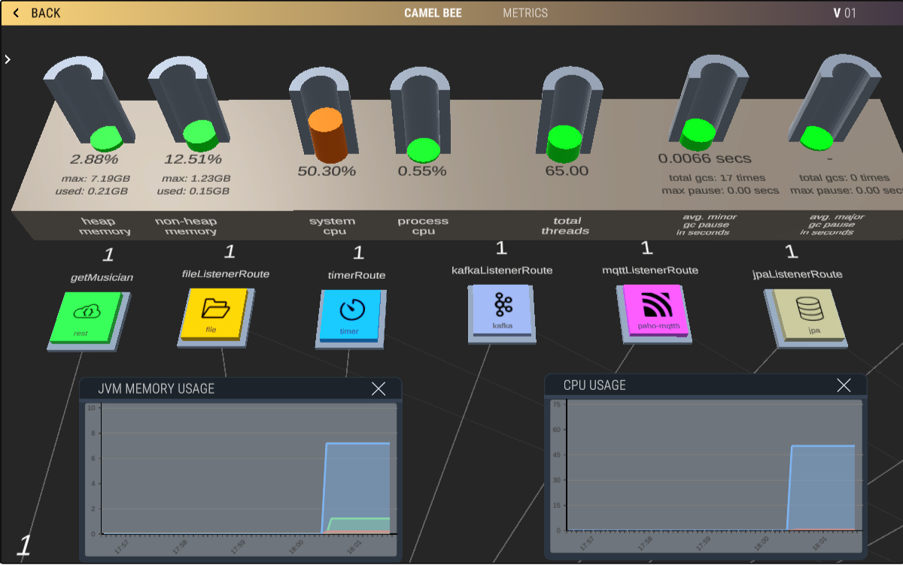

# CamelBee - Apache Camel Library for Microservices Monitoring and Debugging in the CamelBee WebGL Application

CamelBee java core libraries are engineered to extract the architecture of Camel Routes, pinpoint endpoints, and map out the interconnections among them
to visualize the topology within either the CamelBee WebGL application (https://www.camelbee.io) or through the local Docker version (accessed at http://localhost:8083 by executing 'docker run -d -p 8083:80 camelbee/webgl').

[](https://www.youtube.com/watch?v=W29ilyAsXlM)

## Features

### Route Visualization
- Effortlessly visualize complex Camel routes and their interconnections for a better understanding of your microservice architecture.
- Gain a clear overview of message routing and flow paths within your application.

[](https://www.youtube.com/watch?v=W29ilyAsXlM)

### Message Tracing
- Trace messages as they traverse through Camel routes, enabling real-time debugging and issue identification.
- Detect bottlenecks, errors, or unexpected behavior in your message processing.

[](https://www.youtube.com/watch?v=W29ilyAsXlM)
 
### Debugging and Replay
- Debug Camel routes interactively by inspecting message contents, and analyzing route behavior.
- Replay debug sessions to reproduce and investigate issues.
- Navigate through the debugging session's timeline, moving back and forth, to thoroughly analyze the process flow.

[](https://www.youtube.com/watch?v=W29ilyAsXlM)

### Filtering
- Seamlessly filter messages to display only the relevant ones.

[](https://www.youtube.com/watch?v=W29ilyAsXlM)

### Trigger Consumer Endpoints
- Initiate any kind of consumer endpoints direclty from the 3D environment and track message traffic.

[](https://www.youtube.com/watch?v=W29ilyAsXlM)

### Real-time Monitoring
- Monitor Camel microservices with essential metrics and variables, ensuring the health and performance of your application.
- Retrieve comprehensive metrics data to keep your microservices running smoothly.
- Concurrently invoke consumer endpoints to conduct a stress test.

[](https://www.youtube.com/watch?v=W29ilyAsXlM)

  
---

## Project Structure

The project is structured as follows:

```shell
camelbee/
|-- core/
| |-- quarkus-core/
| | |-- README.md
| | |-- ...
| |-- springboot-core/
| | |-- README.md
| | |-- ...
|-- examples/
| |-- allcomponent-quarkus-sample/
| | |-- README.md
| | |-- ...
| |-- allcomponent-springboot-sample/
| | |-- README.md
| | |-- ...
|-- README.md
```

- `camelbee`:
  - `core`: Contains the core modules for CamelBee.to integrate with either the CamelBee WebGL application (https://www.camelbee.io) or through the local Docker version (accessed at http://localhost:8083 by executing 'docker run -d -p 8083:80 camelbee/webgl').
    - `quarkus-core`: Quarkus-specific core module.
    - `springboot-core`: Spring Boot-specific core module.
    - 
  - `examples`: Contains example projects demonstrating the usage of CamelBee.
    - `allcomponent-quarkus-sample`:  Quarkus example project which uses camelbee-quarkus-starter library.
    - `allcomponent-springboot-sample`: Spring Boot example project which uses camelbee-springboot-starter library.

Each subproject have its own README file for detailed information specific to that project.


## Getting Started For Quarkus Projects:

For more details, please refer to the [CamelBee SpringBoot Core README](https://github.com/egekaraosmanoglu/camelbee/blob/main/core/springboot-core/README.md).

## Getting Started For SpringBoot Projects:

For more details, please refer to the [CamelBee Quarkus Core README](https://github.com/egekaraosmanoglu/camelbee/blob/main/core/quarkus-core/README.md).


## License

This project is licensed under the the Apache License, Version 2.0. Feel free to use, modify, and distribute it as per the license terms.

For specific license information for individual subprojects, refer to their respective README files.
