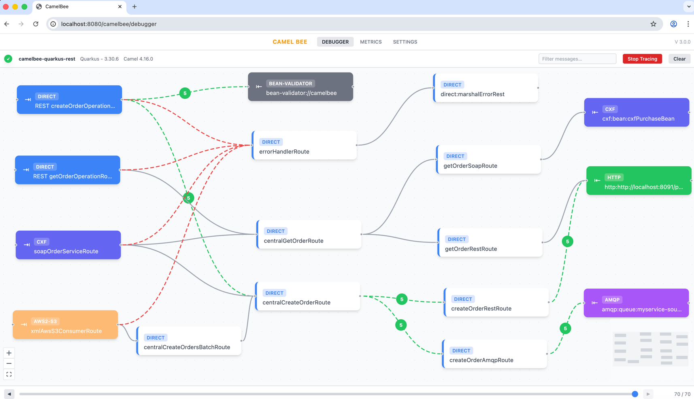
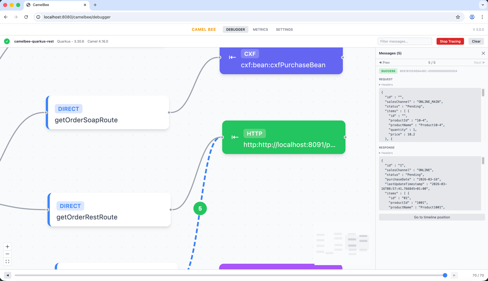
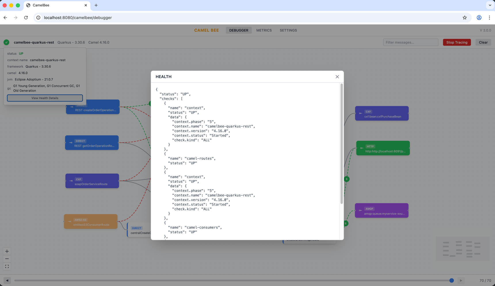
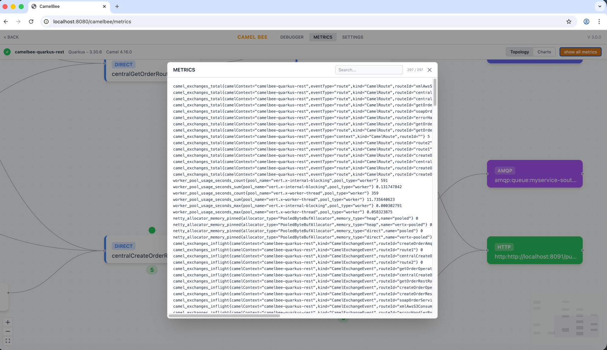
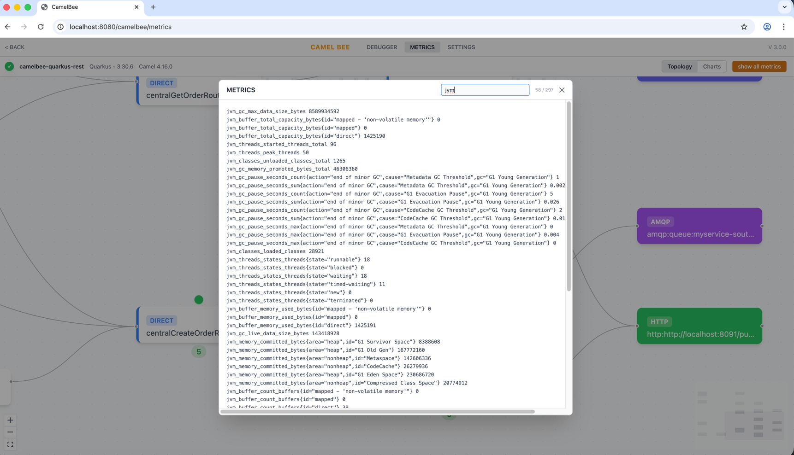
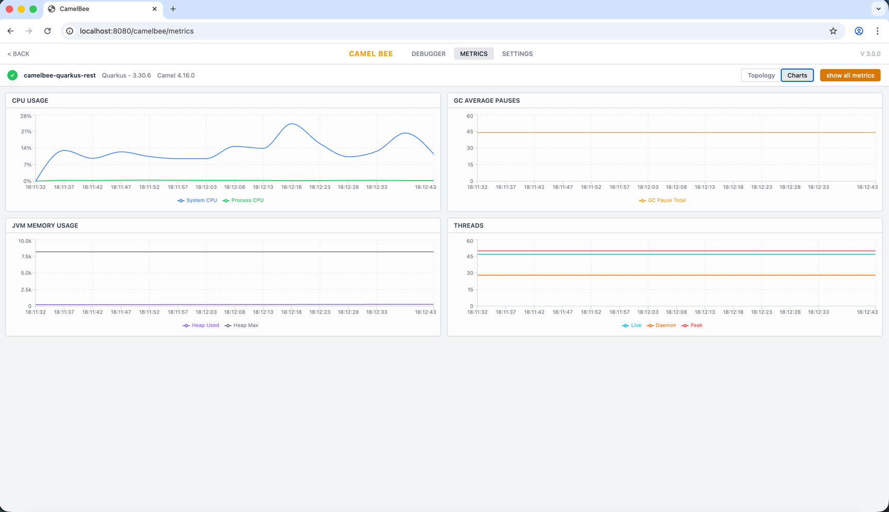
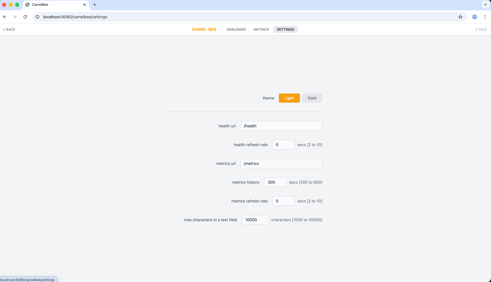

# CamelBee User Guide

## Contents

- [Introduction](#introduction)
- [Debugger Page](#debugger-page)
  - [Route Visualization](#route-visualization)
  - [Message Tracing](#message-tracing)
  - [Message Panel](#message-panel)
  - [Health Panel](#health-panel)
  - [Filtering Messages](#filtering-messages)
- [Metrics Page](#metrics-page)
  - [Metrics Topology](#metrics-topology)
  - [Metrics Detail Modal](#metrics-detail-modal)
  - [Metrics Charts](#metrics-charts)
- [Settings Page](#settings-page)

---

## Introduction

CamelBee is an Apache Camel library for microservices monitoring and debugging. It provides an **embedded React UI** served directly from your application, offering route visualization, message tracing, debugging, and real-time metrics.

To enable your Camel microservices to work with CamelBee, follow the setup instructions in the core library READMEs:

- **Spring Boot:** [CamelBee SpringBoot Core README](https://github.com/egekaraosmanoglu/camelbee/tree/main/core/springboot-core)
- **Quarkus:** [CamelBee Quarkus Core README](https://github.com/egekaraosmanoglu/camelbee/tree/main/core/quarkus-core)

For working examples, see the [camelbee-examples](https://github.com/camelbee/camelbee-examples) repository.

Once your application is running, the CamelBee UI is available at:

`http://localhost:8080/camelbee/index.html`

The UI has four main sections accessible from the top navigation bar: **Debugger**, **Metrics**, and **Settings**.

---

## Debugger Page

The Debugger page is the main workspace of CamelBee. It visualizes the topology of your Camel routes as an interactive graph, showing routes, endpoints, and their interconnections.

### Route Visualization

- Routes are displayed as nodes in the graph, color-coded by type (REST, DIRECT, KAFKA, HTTP, CXF, etc.).
- Connections between routes are shown as dashed lines, with colors indicating successful (green) or failed (red) message flow.
- The graph is interactive — you can zoom in/out and pan to explore complex route topologies.
- The health panel on the left displays the application status, context name, framework version, Camel version, JVM, and garbage collector information. Click **View Health Details** to see the full health check JSON response.

### Message Tracing

- Click **Start Tracing** in the toolbar to begin capturing messages exchanged between routes.
- Click **Stop Tracing** to stop capturing.
- Use the **timeline bar** at the bottom of the page to navigate through the captured messages. Move the slider or use the prev/next buttons to step through the message flow.
- The topology graph animates to show which routes and connections were involved at each point in time, with color-coded edges (green for success, red for failure).
- The **Clear** button resets all collected messages for a fresh start.

> **Note:** When tracing is enabled, all messages exchanged between routes are collected. Use with caution in production environments.

### Message Panel

Click on any connection badge (the numbered circles on the edges between routes) to open the Message Panel on the right side.

The Message Panel displays the details of each message exchanged within that connection:

- **Request headers and body** sent for the interaction.
- **Response headers and body** received for the interaction.
- If an exception occurred, the error message is displayed and the status shows **FAILURE** instead of **SUCCESS**.
- Navigate through messages using the **Prev** and **Next** buttons.
- Click **Go to timeline position** to jump to the exact point in time when this interaction occurred on the global timeline.

### Health Panel

The Health Panel provides a quick overview of your microservice's health status.

- The panel on the left shows the application status (UP/DOWN), context name, framework version, Camel version, JVM, and garbage collector information.
- Click **View Health Details** to open a modal displaying the full health check JSON response, including `camel-context`, `camel-routes`, and `camel-consumers` status.

### Filtering Messages

- Use the **Filter messages...** text field in the toolbar to filter traced messages by keyword.
- This helps you focus on specific routes or endpoints when debugging complex message flows.

---

## Metrics Page

The Metrics page allows you to monitor your Camel microservice's performance and health in real time. It has two views: **Topology** and **Charts**, which you can toggle using the buttons in the top-right corner.

### Metrics Topology

The topology view shows the same route graph as the Debugger page, but overlaid with exchange count metrics. This lets you visualize traffic flow across your routes.

- Concurrently invoke consumer endpoints to conduct stress tests and observe how traffic flows through your routes.

### Metrics Detail Modal

Click **show all metrics** to open a modal displaying all available metrics from your application's metrics endpoint.

- Use the **filter text field** at the top of the modal to search metrics by keyword and quickly find the data you need.

### Metrics Charts

Switch to the **Charts** view to see real-time charts tracking key performance indicators:

- **CPU Usage** — System CPU and process CPU usage over time.
- **GC Average Pauses** — Garbage collection pause total over time.
- **JVM Memory Usage** — Heap used vs heap max over time.
- **Threads** — Live, daemon, and peak thread counts over time.

Charts auto-refresh based on the metrics refresh rate configured in Settings.

---

## Settings Page

The Settings page allows you to configure the CamelBee UI to match your application's setup.

Available settings:

| Setting | Description | Default |
|---------|-------------|---------|
| **Theme** | Switch between Light and Dark mode | Light |
| **Health URL** | Path to the health endpoint | `/health` |
| **Health Refresh Rate** | How often to poll the health endpoint (2–10 seconds) | 5 secs |
| **Metrics URL** | Path to the metrics endpoint | `/metrics` |
| **Metrics History** | Duration of metrics history to retain (300–600 seconds) | 300 secs |
| **Metrics Refresh Rate** | How often to poll the metrics endpoint (2–10 seconds) | 5 secs |
| **Max Characters in a Text Field** | Maximum characters displayed in message text fields (1000–30000) | 10000 |

Settings are persisted in the browser's local storage and applied immediately.
